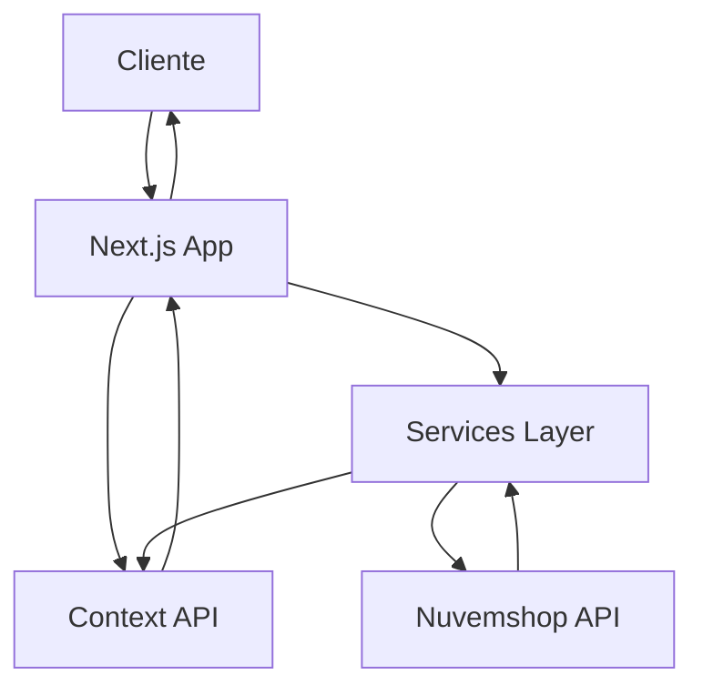

# Nutreon - E-commerce Headless com Nuvemshop

Aplicação e-commerce moderna construída com Next.js, TypeScript e integração completa com a API da Nuvemshop. Oferece uma experiência de compra rápida e responsiva com checkout otimizado.

## 🚀 Stack Tecnológica

- **Framework:** Next.js 15.3.3 + React 19.0.0
- **TypeScript:** 5.x
- **Estilização:** Styled Components 6.1.19 + Tailwind CSS 3.4.1
- **Animações:** Framer Motion 11.5.4
- **HTTP Client:** Axios 1.8.4
- **UI Components:** Material-UI 7.0.0 + Nimbus Design System
- **Ícones:** React Icons 5.5.0 + Heroicons 2.2.0
- **Gerenciamento de Estado:** Context API
- **Formulários:** React Hook Form 7.58.1
- **E-commerce:** Integração Nuvemshop API v1

## 📋 Sumário
- [Visão Geral](#visão-geral)
- [Features](#features)
- [Requisitos](#requisitos)
- [Instalação](#instalação)
- [Configuração Nuvemshop](#configuração-nuvemshop)
- [Desenvolvimento](#desenvolvimento)
- [Estrutura do Projeto](#estrutura-do-projeto)
- [Arquitetura](#arquitetura)
- [Deploy](#deploy)

## 🎯 Visão Geral

Nutreon é uma solução e-commerce headless que combina a robustez da API Nuvemshop com a performance e flexibilidade do Next.js. O projeto segue uma arquitetura modular com componentes reutilizáveis, estado global gerenciado via Context API e integração completa com OAuth 2.0.

## ✨ Features

### E-commerce Completo
- 🛍️ Catálogo de produtos com filtros e busca
- 🏷️ Categorias hierárquicas
- 🛒 Carrinho de compras persistente
- 💳 Checkout multi-etapas
- 📦 Cálculo de frete integrado
- 🎟️ Sistema de cupons de desconto
- 💰 Múltiplas formas de pagamento (Cartão, Boleto, Pix)
- 👤 Área do cliente com histórico de pedidos

### Técnicas
- ⚡ Server Side Rendering (SSR)
- 📱 Design responsivo mobile-first
- 🔍 SEO otimizado
- 🌐 Suporte multi-idioma (pt, es, en)
- 🔐 Autenticação OAuth 2.0
- 📊 Rate limiting automático
- 🎨 Tema customizável
- ♿ Acessibilidade (WCAG 2.1)

## 📋 Requisitos

- Node.js >= 18.x
- npm, yarn, pnpm ou bun
- Conta de parceiro Nuvemshop
- Docker (opcional, para containerização)

## 🚀 Instalação

```bash
# Clone o repositório
git clone https://github.com/seu-usuario/nutreon.git
cd nutreon

# Instale as dependências
npm install
# ou
yarn install
# ou
pnpm install

# Configure as variáveis de ambiente
cp .env.example .env.local

# Execute em modo desenvolvimento
npm run dev
# ou
yarn dev
# ou
pnpm dev
```

Acesse [http://localhost:3000](http://localhost:3000) no navegador.

## 🔧 Configuração Nuvemshop

### 1. Criar Aplicação no Painel de Parceiros

1. Acesse o [Painel de Parceiros Nuvemshop](https://partners.nuvemshop.com.br)
2. Crie uma nova aplicação
3. Escolha o tipo "Aplicação Externa (Standalone)"
4. Configure a URL de callback: `http://localhost:3000/callback`

### 2. Configurar Variáveis de Ambiente

```env
# Nuvemshop OAuth
NEXT_PUBLIC_NUVEMSHOP_CLIENT_ID=seu_client_id_aqui
NEXT_PUBLIC_NUVEMSHOP_CLIENT_SECRET=seu_client_secret_aqui
NEXT_PUBLIC_NUVEMSHOP_REDIRECT_URI=http://localhost:3000/callback
NEXT_PUBLIC_NUVEMSHOP_STORE_ID=id_da_loja_demo

# Nuvemshop API
NUVEMSHOP_ACCESS_TOKEN=token_de_acesso_aqui
NEXT_PUBLIC_NUVEMSHOP_API_VERSION=v1

# Aplicação
NEXT_PUBLIC_APP_URL=http://localhost:3000
NEXT_PUBLIC_CURRENCY=BRL
NEXT_PUBLIC_LOCALE=pt-BR

# Pagamento (opcional)
NEXT_PUBLIC_PAYMENT_GATEWAY=mercadopago
PAYMENT_SECRET_KEY=chave_secreta_gateway
```

### 3. Obter Token de Acesso

1. Execute a aplicação: `npm run dev`
2. Acesse: `http://localhost:3000/auth`
3. Clique em "Conectar com Nuvemshop"
4. Autorize a aplicação
5. O token será salvo automaticamente

## 💻 Desenvolvimento

### Scripts Disponíveis

```bash
# Desenvolvimento
npm run dev         # Inicia servidor de desenvolvimento
npm run build       # Build de produção
npm run start       # Inicia servidor de produção
npm run lint        # Executa linter
npm run type-check  # Verifica tipos TypeScript

# Storybook
npm run storybook   # Inicia Storybook
npm run build-storybook # Build do Storybook

# Docker
docker-compose up   # Inicia com Docker
docker-compose down # Para containers
```

### Padrões de Código

O projeto segue padrões rigorosos documentados em `ARCHITECTURE.md`:

- **Componentes:** 3 arquivos (componente.tsx, styles.tsx, typo.ts)
- **Estilização:** Styled Components + Tailwind CSS
- **Estado:** Context API para estado global
- **Services:** Camada de abstração para API
- **TypeScript:** Tipagem completa, evitar `any`
- **Commits:** Convenção em português

## 📁 Estrutura do Projeto

```
src/
├── app/                 # Next.js App Router
│   ├── produtos/       # Páginas de produtos
│   ├── carrinho/       # Carrinho de compras
│   ├── checkout/       # Fluxo de checkout
│   └── conta/          # Área do cliente
├── components/         # Componentes reutilizáveis
│   ├── product/       # Componentes de produto
│   ├── cart/          # Componentes de carrinho
│   ├── checkout/      # Componentes de checkout
│   └── common/        # Componentes comuns
├── context/           # Contextos globais
│   ├── auth.tsx       # Autenticação OAuth
│   ├── cart.tsx       # Estado do carrinho
│   ├── checkout.tsx   # Estado do checkout
│   └── customer.tsx   # Dados do cliente
├── services/          # Integração com APIs
│   └── nuvemshop/    # Serviços Nuvemshop
├── hooks/             # Custom hooks
├── utils/             # Funções utilitárias
└── types/             # Definições TypeScript
```

## 🏗️ Arquitetura

### Fluxo de Dados



### Contextos Principais

1. **AuthContext**: Gerencia autenticação OAuth
2. **CartContext**: Estado do carrinho de compras
3. **CheckoutContext**: Dados e fluxo de checkout
4. **CustomerContext**: Informações do cliente logado
5. **LoaderContext**: Estados de carregamento global

### Services

- **Products**: Busca e filtragem de produtos
- **Categories**: Navegação por categorias
- **Cart**: Operações do carrinho (local)
- **Checkout**: Cálculo de frete e pedidos
- **Customers**: Perfil e endereços
- **Orders**: Histórico e acompanhamento

## 🐳 Docker

### Build e Execução

```bash
# Build da imagem
docker build -t nutreon .

# Executar com docker-compose
docker-compose up -d

# Verificar logs
docker-compose logs -f

# Parar aplicação
docker-compose down
```

### Configuração Docker

O projeto inclui:
- `Dockerfile`: Multi-stage build otimizado
- `docker-compose.yml`: Orquestração de containers
- `.dockerignore`: Arquivos ignorados no build

## 🚀 Deploy

### Vercel (Recomendado)

1. Conecte o repositório no [Vercel](https://vercel.com)
2. Configure as variáveis de ambiente
3. Deploy automático a cada push na branch main

### Outros Provedores

O projeto é compatível com qualquer plataforma que suporte Next.js:
- AWS Amplify
- Netlify
- Railway
- Render
- Google Cloud Run

### Variáveis de Produção

Certifique-se de atualizar as URLs para produção:

```env
NEXT_PUBLIC_NUVEMSHOP_REDIRECT_URI=https://seudominio.com/callback
NEXT_PUBLIC_APP_URL=https://seudominio.com
```

## 📚 Documentação Adicional

- [ARCHITECTURE.md](./ARCHITECTURE.md) - Guia completo de arquitetura e padrões
- [Nuvemshop API Docs](https://tiendanube.github.io/api-documentation/intro)
- [Nimbus Design System](https://nimbus.nuvemshop.com.br)

## 🤝 Contribuindo

1. Fork o projeto
2. Crie uma branch: `git checkout -b feature/nova-feature`
3. Commit suas mudanças: `git commit -m 'feat: adiciona nova feature'`
4. Push: `git push origin feature/nova-feature`
5. Abra um Pull Request

## 📄 Licença

Este projeto está sob a licença MIT. Veja o arquivo [LICENSE](LICENSE) para mais detalhes.

---

**Desenvolvido com ❤️ usando Next.js e Nuvemshop API**